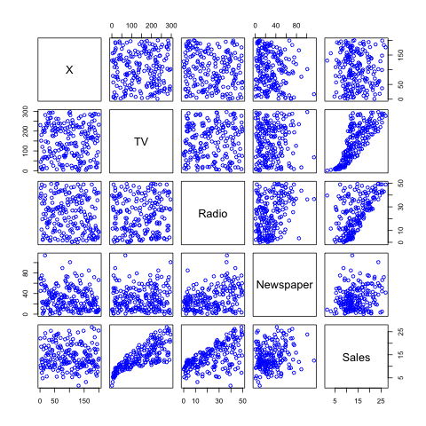

# Abstract
This homework is to reproduce the analysis from Section 3.2 (pages 71 to 82), from the book "An Introduction to Statistical Learning" (by James et al). It includues multiple linear regressin with the predictor variables TV, Radio, Newspaper and the response variable Sales.


# Introduction
According to the book, the overall goal is to provide advice on how to improve sales of the particular product. More specifically, the idea is to determine whether there is an association between advertising and sales, and if so, develop an accurate model that can be used to predict sales on the basis of the three media budgets. Rather than comparing variables separately, we fit a multiple linear regression model, as discussed in the methodology part to analyze such association.


# Data
The dataset **Advertising.csv** comes from *"http://www-bcf.usc.edu/~gareth/ISL/Advertising.csv* It consists for TV, Radio, Newspaper and Sales columns. The structure of the columns are stored in numeric vectors. 


# Methodology
In this paper, we mainly consider the relatinoship between Sales versus **TV**, **Radio** and **Newspaper**. In order to explore this multiple variable relationship, we use a multiple linear model and regress `sales` onto `TV`, `Radio`, `Newspaper` by fitting the model:

$$Sales = \beta_{0} + \beta_{1} TV + \beta_{2} Radio + \beta_{3} Newspaper$$

Mathematically, $\beta_{0}$ represents the intercept and $\beta_{1}$ to $\beta_{3}$ represents the slope terms in the linear model.
With this linear model, we estimate the coefficients by minimizing the least squares criterion, which is minimizing the sum of squared errors.


# Results

```{r, echo=FALSE}
# Setting working directory
setwd("~/Documents/stat159/stat159-fall2016-hw03")

# load data and library
options(warn = -1)
library(xtable)
library(png)
library(grid)
load('data/regression.RData')
load('data/correlation-matrix.RData')
Advertising <- read.csv("data/Advertising.csv")
source("code/functions/regression-functions.R")
```

Let's start with looking at three simple linear regression about how sales is related to each individual feature.

## TV Advertisement and Sales

```{r, echo=FALSE, results='asis'}
tv = xtable(tv_summary$coefficients, caption = 'Simple Linear Regression on TV and Sales')
print(tv, comment=FALSE, type = "latex", caption.placement = 'top')
```

This table provides details of the least squares model for the regression of number of units sold on TV advertising budget for the Advertising data. We can conclude that the two coefficients are not zero. 

## Radio Advertisement and Sales

```{r, echo=FALSE, results='asis'}
radio = xtable(radio_summary$coefficients, caption = "Simple Linear Regression on Radio and Sales")
print(radio, comment=FALSE, type = "latex", caption.placement = 'top')
```

This table provides details of the least squares model for the regression of number of units sold on Radio advertising budget for the Advertising data. We can conclude that the two coefficients are not zero. 

## Newspaper Advertisement

```{r, echo=FALSE, results='asis'}
newspaper = xtable(news_summary$coefficients, caption = "Simple Linear Regression on Newspaper and Sales")
print(newspaper, comment=FALSE, type = "latex", caption.placement = 'top')
```

This table provides details of the least squares model for the regression of number of units sold on Newspaper advertising budget for the Advertising data. We can conclude that the two coefficients are not zero. 


## All Advertisements 

Now let's look at a multiple linear regression. We can find out the changes in sales based of these three advertisements and check if there is a correlation between the advertisements. The multiple linear regression with 3 predictors equations is the following: 
$$Sales = \beta_{0} + \beta_{1} * TV + \beta_{2} * Radio + \beta_{3} * Newspaper$$

```{r, results='asis', echo=FALSE}
cat("\\newpage")
```

Here is the table stat:

```{r, echo=FALSE, results='asis'}
multiple = xtable(model_summary$coefficients, caption = "Multiple Linear Regression")
print(multiple, comment=FALSE, type = "latex", caption.placement = 'top')
```


The simple and multiple regression coefficients can be quite different. This difference stems from the fact that in the simple regression case, the slope term represents the average effect of a $1,000 increase in newspaper advertising, ignoring other predictors such as TV and radio. In contrast, in the multiple regression setting, the coefficient for newspaper represents the average effect of increasing newspaper spending by $1,000 while holding TV and radio fixed.
But do all of these statistics make sense? Let's look at correlation between each feature.

## Correlation Matrix

```{r, echo=FALSE, results='asis'}
corr = xtable(corr_matrix, caption = "Correlations Matrix")
print(corr, comment=FALSE, type = "latex", caption.placement = 'top')
```

This table indicates correlation matrix for TV, radio, newspaper, and sales for the Advertising data. This correlation matrix explains a lot. From previous three each simple linear models, we learned that all of the predictors are useful in predicting the response. Now again looking at the correlation, we make verify that there is clear strong correlation between sales and TV, Radio. Although we also found out Newspaper has the weakest relation with sales, yet it is some what related with Radio.


Next, let's examine the quality of fitness by analyzing key statistics

## Regression Quality Indices
```{r, echo=FALSE, results='asis'}
RSE = residual_std_error(model)
R_square = r_squared(model)
f_statistic = f_statistic(model)

df = data.frame(Quantity= c("Residual Standard Error", "R-squared",
                            "F-statistic"), Value = c(RSE, R_square,
                                                      f_statistic))
print(xtable(df, caption = 'Regression Quality Indices'), comment = FALSE, caption.placement = 'top')
```

From this table, we can first examined R squared, which is .90. This means the data is a good fit to the regression line. The F-statistics is high, which mean at least one advertisement has a correlation with Sales.
Further, with conclusion from the correlation matrix, although Newspaper may not be a good predictor, yet TV and Radio are the good predictors. And they fit the data pretty well based on the statistics we seen here. 

Here are some sample images relating Advertising dataset




## Conclusions
We have learned the simple linear relationship between TV, Radio and Newspapers versus Sales. Now we have fitted a multiple linear regression model upon all of the advertising data so that we could get more insight about the information hidden behind the data. From the reproduced statistics and charts, we have seen the same results as produced in the book. Quoted, "a linear fit captures the essence of the relationship, although it is somewhat deficient in the left of the plot." This project helps us to better analyze the multiple linear regression model, and what are some mathematical interpretations. It also gives us great insights in the reproducible project. And this project highlights the significance of reproducibility.


